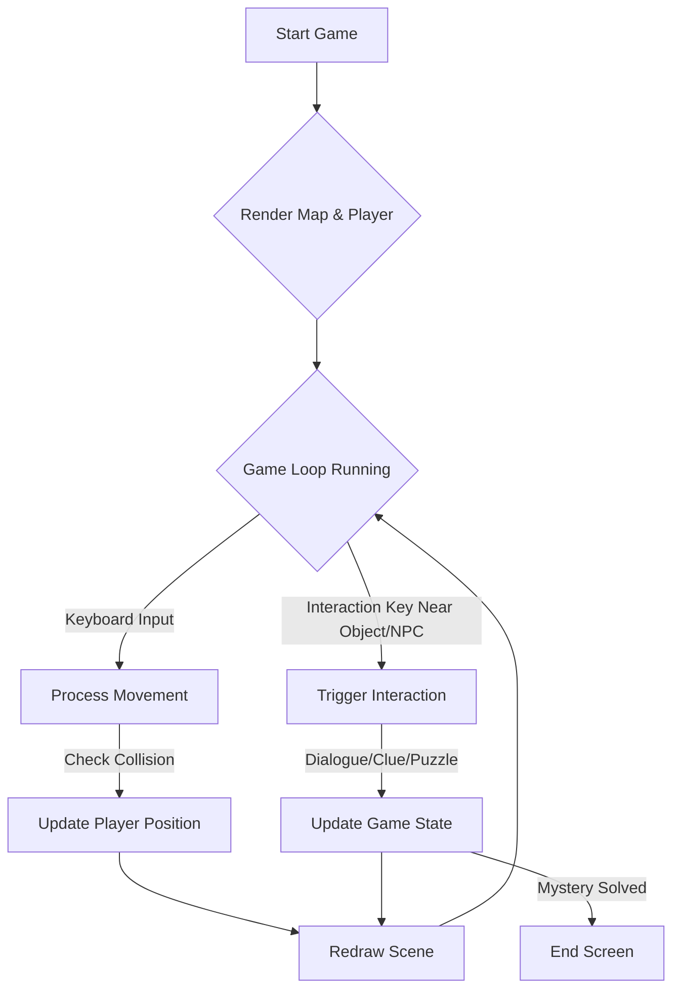

# Birthday Detective Game - Architecture Plan (Top-Down Style)

This document outlines the planned setup and architecture for a top-down, tile-based detective game, inspired by classic exploration games.

## 1. Goal

Create a short (approx. 15 minutes playtime), simple detective game for a 9-year-old, playable directly in a web browser. The game will feature puzzle and adventure elements where the player acts as a detective to solve a simple mystery.

## 2. Technology Stack

*   **HTML:** Provides the main page structure, likely including an HTML `<canvas>` element for rendering the game.
*   **CSS:** Basic styling for the page elements outside the game canvas.
*   **JavaScript:** Handles all game logic, including:
    *   Game loop (input processing, state updates, rendering).
    *   Rendering graphics (tilemaps, sprites) to the canvas.
    *   Player movement and collision detection.
    *   Interaction logic (talking to NPCs, examining objects).
    *   State management (player position, inventory, quest progress).
*   **Optional JavaScript Library:** A 2D game library (e.g., Kaboom.js, Kontra.js, Phaser) might be used to simplify development by providing tools for rendering, input, physics, and asset management. The specific library choice is TBD.
*   **Assets:**
    *   **Tileset(s):** Image files containing tiles for building the game map (floors, walls, objects).
    *   **Sprite Sheet(s):** Image files for the player character (and potentially NPCs) showing different directions and animations.
    *   Optional sound effects and music.

## 3. Game Structure & Flow

The game will feature a top-down perspective where the player controls a character sprite using keyboard input (arrow keys) to navigate tile-based maps representing different locations (e.g., house rooms, garden).

*   **Movement:** Player moves on a grid, with collision detection preventing movement through obstacles (walls, furniture).
*   **Interaction:** Player interacts with objects or NPCs by moving adjacent to them and pressing an interaction key (e.g., 'E' or 'Space'). Interactions trigger dialogue, reveal clues, or initiate simple puzzles.
*   **Progression:** The game progresses as the player explores, gathers clues, and solves puzzles to uncover the central mystery.
*   **Game Loop:** A core loop will handle input, update player/game state, and redraw the scene continuously.

**Conceptual Flow:**



## 4. Proposed Project File Structure

```
/
├── index.html         # Main HTML file for the game
├── style.css          # CSS for styling
├── game.js            # JavaScript for game logic
├── README.md          # Top-level project overview
└── docs/
│   ├── architecture.md # This document
│   ├── script.md       # Story script and details
│   └── tasks.md        # Project task checklist
└── assets/
    ├── images/        # Directory for image assets
    │   ├── tilesets/  # Tileset images
    │   └── sprites/   # Sprite sheet images
    └── sounds/        # Optional: Directory for sound assets
```
*(Note: File structure updated to reflect documentation move)*

## 5. Key Considerations

*   **Scope:** Keep the map size, number of locations, and complexity of interactions manageable for a short game (~15 mins).
*   **Interactivity:** Focus on keyboard-based movement and a single interaction key.
*   **Puzzles:** Integrate simple, observation-based or dialogue-based puzzles suitable for the target age.
*   **Feedback:** Provide clear visual cues for interactive objects and feedback during interactions (e.g., text boxes).
*   **Visuals:** Use a consistent, clear pixel art style for tiles and sprites.
*   **Collision:** Implement basic grid-based collision detection.